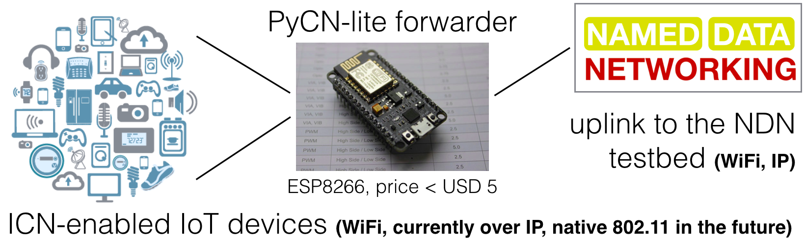

# PyCN-lite

README.md v2018-02-06

This is lightweight implementation of the two ICN protocols NDN and CCNx.

The code is written for Micropython
[1.9.3](http://docs.micropython.org/en/v1.9.3/pyboard/)
and runs on IoT devices like the ESP8266 with 28K RAM; UNIX
environments with standard Python3 (or Micropython) are supported, too.

Servers included in PyCN-lite (both UNIX and ESP8266):
* reposerver
* forwarder (work in progress, after having introduced our own event loop)

Command line tools included (UNIX only):
* fetch, repo_ls, repo_put, dump_ndn2013, dump_ccnx2015

Library included:
* NDN and CCNx parsing/formatting library, can be used in IoT end devices

Example config using an ESP8266 as a local ICN/WiFi access point and serving at the same time as a gateway to the NDN testbed:




## FORWARDER Howto (ESP8266)

* install Micropython on the ESP8266
* configure the WiFi access point for 192.168.4.1 and essid of your choice
* adjust the default settings in icn/server/config.py
* transfer the content of the 'icn' source code directory to '/lib/icn' on the ESP8266
* run the following commands on the console (or put them into the boot.py script):
```
>>> import icn.server.fwd as f
>>> f.start()
PyCN-lite forwarder at ('192.168.4.1', 6363) serving ['ndn2013', 'ccnx2015']
  /ndn --> ('128.252.153.194', 6363)

packets in/out/invalid: 0 0 0
packets in/out/invalid: 0 0 0
packets in/out/invalid: 2 2 0
packets in/out/invalid: 3 5 0
...
```
which will start the forwarder on port 6363. CTRL-C ends server execution.


## REPOSERVER Howto (ESP8266)

* install Micropython on the ESP8266
* configure the WiFi access point for 192.168.4.1 and essid of your choice
* transfer the content of the 'icn' source code directory to '/lib/icn' on the ESP8266
* run the following commands on the console (or put them into the boot.py script):
```
>>> import icn.server.repo as r
>>> r.start()

>>> import icn.server.fwd as f
>>> f.start()
PyCN-lite repo server at ('192.168.4.1', 6363) serving ['ndn2013', 'ccnx2015']
```
which will start the repo server on port 6363. CTRL-C ends server execution.


## FETCH Howto (UNIX commandline)
```
% cd icn/bin

% ./fetch.py 192.168.4.1:6363 /ndn/pycn-lite/LICENSE
% ./fetch.py --suite ccnx2015 192.168.4.1:6363 /ccnx/pycn-lite/LICENSE
```

## REPO_LS Howto (UNIX) -- show content of a file system repo
```
% cd icn/bin

% ls -1 demo_repo_dir/
238703794c9a9d8f5757d92f.d65303ac7a9a1b94ec06f7c0
350d8f87c7c04e7e56e212b4.7eba6e1b94ad4f8786ade4d6
prefix.3885558c37222613acca6faa
prefix.ac6dcf268096fcc84a8238dc

% ./repo_ls.py demo_repo_dir
content (suite=ccnx2015, len=1639): /ccnx/pycn-lite/LICENSE
content (suite=ndn2013, len=1631): /ndn/pycn-lite/LICENSE
prefix (suite=ndn2013): /ndn/pycn-lite
prefix (suite=ccnx2015): /ccnx/pycn-lite
```

## REPO_PUT Howto (UNIX) - add content to a file system repo
```
% cd icn/bin

% ./repo_put.py --prefix /ndn/pycn-lite demo_repo_dir /ndn/pycn-lite/LICENSE <../../LICENSE 
% ./repo_put.py --prefix /ccnx/pycn-lite --suite ccnx2015 demo_repo_dir /ccnx/pycn-lite/LICENSE <../../LICENSE
```

The above commands were used to populate the demo repo directory. The
prefix parameter persists a prefix if is it not already existing: the
parameter can be ommitted in subsequence put operations.


## REPOSERVER Howto (UNIX) - run a ICN repo server

```
% cd icn/bin

% ./reposerver.py demo_repo_dir 127.0.0.1:6363 &
# or:
% micropython ./reposerver.py demo_repo_dir 127.0.0.1:6363 &
```
See icn/server/config.py for default parameters


## FORWARDER Howto

work in progress

## TODO

* make this a Python package (setup.cfg etc)
* move the pycn-lite/icn/bin directory to pycn-lite/bin
* remove the absolute paths for micropython
* validate the packet formats
* add the FLIC library
* ...

## Confirmed IoT devices running the PyCN-lite software:

ESP8266 (features separate WiFis for uplink and local AP, has 28KB RAM)
* [nodeMCU](http://nodemcu.com/index_en.html)
